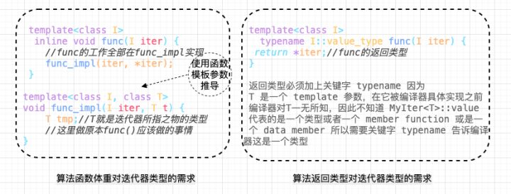

# 迭代器(iterator) 与 Traits 萃取技术

迭代器：扮演容器与算法之间的粘合剂，也是一种智能指针或者称之为“泛型指针”，共有五种类型，以及其他衍生变化。从其实现角度看，与智能指针很是相像，重载了`operator->`,`operator++`,`operator--`等操作符的 class template。STL 容器都有自己专属的迭代器。 native pointer 也是迭代器。

## 迭代器(iterator)设计模式

在《设计模式：可复用面向对象软件的基础》（GOF）一书，谈到了 [23 种设计模式](http://c.biancheng.net/view/1320.html)，其中就有 iterator 迭代模式，其定义：提供一个对象来顺序访问聚合对象中的一系列数据，而不暴露聚合对象的内部表示。定义里面说明的聚合对象实际上对应的就是 STL 当中的容器。
如何区分 STL 和 GOF 设计模式中所介绍的iterator？STL 中使用的迭代器效率较高。
为什么那么说，STL 使用的是 GP(Generic Programming)编程，GOF使用的是OOP(Object Oriented Programming)面向对象编程。

GP：泛型编程，也叫做“静态多态”，泛型即是指具有在多种数据类型上皆可操作的含义，泛型编程让你编写完全一般化并可重复使用的算法，其效率与针对某特定数据类型而设计的算法相同。具体的数据类型在编译时期确定，编译器承担更大的工作量，代码运行效率更高。STL 通过 GP 中将methods(算法)和datas(容器)分离处理。

OOP：面向对象编程，也叫做“动态多态”，通过继承方式，运行时子类access[虚函数表](https://blog.csdn.net/v_JULY_v/article/details/6446364)vptr来判定methods类型。运行时检索vptr就导致了效率会比较低下，而且methods 和 datas是关联在一起的。GOF 便是使用继承。


## 迭代器(iterator) 是一种 smart pointer

auto_ptr：用来包装原生指针(native pointer)的对象，在头文件 <memory> 中定义。

为什么说迭代器也是一种智能指针，每一种容器都有自己的迭代器，以下看一下实例。

实现自己的List容器和迭代器
```cpp
// node
template <typename T>
class ListNode
{
  public:
  T value() {return m_value;}
  ListNode* next() {return m_next;}

  private:
  T m_value;
  ListNode* m_next;
}

// mylist
template <typename T>
class List
{
  public:
  void insert_front(T value);
  void insert_end(T value);

  private:
  ListNode* m_end;
  ListNode* m_front;
}

// ListIterator
template <class TNode> // 传入list的node
class ListIterator
{
  public:
  ListIterator(TNode* p = 0) : m_pNode(p){} // 构造函数
  TNode& operator*() const{return *m_pNode;} // dereference 取值
  TNode* operator->() const{return m_pNode;} // member access 成员访问
  TNode& operator++() {m_pNode = m_pNode->next(); return *this; }
  TNode* m_pNode;
}

```
指针行为中常见的用途是 dereference 和 member access。从以上ListIterator可以看出，迭代器重要一步就是对 `operator*` 和 `oparator->`进行重载。

如，ListIterator中为了实现 `operator++` 暴露了List的内部细节，即ListNode的next()。正是由于设计迭代器过程会暴露容器的许多细节，STL 中就把迭代器的实现交给了容器的设计者，每一个容器都有自己的迭代器，这样也隐藏了所有实现。

### 迭代器(iterator) 的 function template 参数推导

上诉所创建的List，若算法中需声明一个变量，来表示“迭代器所指对象的型别”？C++ 没有 typeof() 类似的函数可以判断类型，这时候就需要
利用 function template 的参数推导机制。

``` cpp
template <class I>
inline void func(I iter)
{
  func_imp(I,*I); // 传入 iter 和 iter 所指的值，class 自动推导
}

template <class I,class T>
inline void func_imp(I iter, T value)
{
  T tmp;  // 迭代器所指的型别
  // func的原本实现
}

int main()
{
  int ia;
  func(&ia);
}
```
### 声明内嵌型别

从上面的例子得出，function template 参数推导，只能推导出参数的类型，无法推导出函数返回值类型。
只能在内部使用，无法返回到外部使用。这样需要其他的方法：声明内嵌型别。
如：

``` cpp
template<typename T>
class MyIter {
public:
    typedef T value_type; //内嵌类型声明
    MyIter(T *p = 0) : m_ptr(p) {}
    T& operator*() const { return *m_ptr;}
private:
    T *m_ptr;
};

//以迭代器所指对象的类型作为返回类型
//注意typename是必须的，它告诉编译器这是一个类型
template<typename MyIter>
typename MyIter::value_type Func(MyIter iter) {
    return *iter;
}

int main(int argc, const  char *argv[]) {
    MyIter<int> iter(new int(666));
    std::cout<<Func(iter)<<std::endl;  //print=> 666
}
```


上面的解决方案看着可行，但其实呢，实际上还是有问题，这里有一个隐晦的陷阱：实际上并不是所有的迭代器都是 class type ，原生指针也是一种迭代器，由于原生指针不是 class type ，所以没法为它定义内嵌型别。


如func是一个泛型算法，那么他必须要接受一个原生指针的迭代器，编译不过去, 所以需要另一个补充原生指针的问题：Partial specialization
```cpp
int* p = new int(5);
cout << func(p) << endl; // error
```

## Traits Partial specialization（模板偏特化）

所谓偏特化是指如果一个 class template 拥有一个以上的 template 参数，我们可以针对其中某个（或多个，但不是全部）template 参数进行特化，比如下面这个例子：
```cpp
template <typename T>
class C {...}; //此泛化版本的 T 可以是任何类型
template <typename T>
class C<T*> {...}; //特化版本，仅仅适用于 T 为“原生指针”的情况，是泛化版本的限制版
```
所谓特化，就是特殊情况特殊处理，第一个类为泛化版本，T 可以是任意类型，第二个类为特化版本，是第一个类的特殊情况，只针对原生指针。

## 原生指针（native pointer） —— 特性 “萃取” traits

虽然 native pointer 属于迭代器但是不属于class，所以无法使用**参数推导机制** + **内嵌型别机制获取型别**来定义内嵌型别，偏特化可以解决这个为问题。看看STL中如何应用，STL中定义了类模板，来专门“萃取”迭代器的一些特性。其中便有上文所提到的 value type：
traits 在 bits/stl_iterator_base_types.h 这个文件中：
```cpp
template<class _Tp>
struct iterator_traits<_Tp*> {
    typedef ptrdiff_t difference_type;
    typedef typename _Tp::value_type value_type;
    typedef typename _Tp::pointer pointer;
    typedef typename _Tp::reference reference;
    typedef typename _Tp::iterator_category iterator_category;
};

template<typename Iterator>
struct iterator_traits {  //类型萃取机
 typedef typename Iterator::value_type value_type; //value_type 就是 Iterator 的类型型别
}
```

加入萃取机前后的变化：
```cpp
template<typename Iterator> //萃取前
typename Iterator::value_type  func(Iterator iter) {
    return *iter;
}

//通过 iterator_traits 作用后的版本
template<typename Iterator>  //萃取后
typename iterator_traits<Iterator>::value_type  func(Iterator iter) { 
    return *iter;
}
```
我们可以看到萃取前Iterator::value_type，萃取后iterator_traits<Iterator>::value_type，仅仅只是加了一层 iterator_traits 封装，就解决了萃取前不支持 native pointer ，萃取后的效果
```cpp
//iterator_traits的偏特化版本，针对迭代器是原生指针的情况
template<typename T>
struct iterator_traits<T*> {
    typedef T value_type;
};
```
用一张图来表示如何获取迭代器的型别


## const 偏特化

通过偏特化添加一层中间转换的 traits 模板 class，能实现对原生指针和迭代器的支持，有的读者可能会继续追问：对于指向常数对象的指针又该怎么处理呢？比如下面的例子：
```cpp
iterator_traits<const int*>::value_type  // 获得的 value_type 是 const int，而不是 int
```
const 变量只能初始化，而不能赋值（这两个概念必须区分清楚）。这将带来下面的问题：
```cpp
template<typename Iterator>
typename iterator_traits<Iterator>::value_type  func(Iterator iter) { 
    typename iterator_traits<Iterator>::value_type tmp; 
    tmp = *iter; // 编译 error
}

int val = 666 ;
const int *p = &val;
func(p); // 这时函数里对 tmp 的赋值都将是不允许的
```
那该如何是好呢？答案还是偏特化，来看实现：
```cpp
template<typename T>
struct iterator_traits<const T*> { //特化const指针
    typedef T value_type; //得到T而不是const T
}
```

## traits编程技法总结

从之上阐述traits编程就是增加中间一层的模板class，以解决获取迭代器的型别中的原生指针问题。利用一个中间层 iterator_traits 固定了 func 的形式，使得重复的代码大量减少，唯一要做的就是稍稍特化一下 iterator_tartis 使其支持 pointer 和 const pointer 。


```cpp
#include <iostream>
#include <stdlib.h>
#include <stdio.h>

template <class T>
struct MyIter {
    typedef T value_type; // 内嵌型别声明
    T* ptr;
    MyIter(T* p = 0) : ptr(p) {}
    T& operator*() const { return *ptr; }
};

// class type
template <class T>
struct my_iterator_traits {
    typedef typename T::value_type value_type;
};

// 偏特化 1
template <class T>
struct my_iterator_traits<T*> {
    typedef T value_type;
};

// 偏特化 2
template <class T>
struct my_iterator_traits<const T*> {
    typedef T value_type;
};

// 首先询问 iterator_traits<I>::value_type,如果传递的 I 为指针,则进入特化版本,iterator_traits 直接回答;如果传递进来的 I 为 class type,就去询问 T::value_type.
template <class I>
typename my_iterator_traits<I>::value_type Func(I ite) {
    std::cout << "normal version" << std::endl;
    return *ite;
}
int main(int argc, const  char *argv[]) {

    MyIter<int> ite(new int(6));
    std::cout << Func(ite)<<std::endl;//print=> 6

    int *p = new int(7);
    std::cout<<Func(p)<<std::endl;//print=> 7
    
    const int k = 8;
    std::cout<<Func(&k)<<std::endl;//print=> 8
     system("pause");
}
```
上述的过程是首先询问 iterator_traits::value_type，如果传递的 I 为指针,则进入特化版本, iterator_traits 直接回答T；如果传递进来的 I 为 class type ，就去询问 T::value_type。

通俗的解释可以参照下图：

总结：核心知识点在于 **模板参数推导机制**+**内嵌类型定义机制**， 为了能处理原生指针这种特殊的迭代器，引入了**偏特化机制**。traits 就像一台 “特性萃取机”，把迭代器放进去，就能榨取出迭代器的特性。

这种偏特化是针对可调用函数 func 的偏特化，想象一种极端情况，假如 func 有几百万行代码，那么如果不这样做的话，就会造成非常大的代码污染。同时增加了代码冗余。

[^_^]: # ()


## 迭代器相应类型(associated types)

traits 意为 “特性”，扮演 “特性萃取机” 角色，萃取各个迭代器的特性(相应类型)。

迭代器相应类型有五种：
  + value type
  + difference type
  + pointer
  + reference
  + iterator category

```cpp
tempalte<typename I>
struct iterator_traits
{
    typedef typename I::iterator_category  iterator_category;
    typedef typename I::value_type  value_type;
    typedef typename I::difference_type  difference_type;
    typedef typename I::pointer  pointer;
    typedef typename I::reference  reference;
};
```


* 迭代器相应类型之一：value type

value type 就是迭代器所指对象的类型。

```cpp
template <class T>
typename iterator_traits<I>::value_type func(I ite)
{
    return *ite;
}
```

* 迭代器相应类型之二：difference type

difference type 用来表示两个迭代器之间的距离。

```cpp
template <class I, class T>
typename iterator_traits<I>::difference_type cout(I first, I last, const T& value)
{
    typename iterator_traits<I>::difference_type n = 0;
    for (; first != last; ++first)
    {
        ++n;
    }
    
    return n;
}
```

* 迭代器相应类型之三：reference type

在 c++ 中，函数如果要传回左值，都是以 by reference 的方式进行，所以如果 p 是一个迭代器，它的 value type 是 T ，那么`*p` 应该是T& (即reference type)

* 迭代器相应类型之四：pointer type

* 迭代器相应类型之五：iterator_category

  + 输入迭代器 (InputIterator) 是能从所指向元素读取的迭代器 (Iterator) 。输入迭代器 (InputIterator) 仅保证单趟算法的合法性。
  + 输出迭代器 (OutputIterator) 是能写入所指元素的迭代器 (Iterator) 。
  + 向前迭代器 (ForwardIterator) 是一种能从所指向元素读取数据的迭代器 (Iterator) 。
  + 双向迭代器 (BidirectionalIterator) 是能双向移动（即自增与自减）的向前迭代器 (ForwardIterator) 。
  + 随机访问迭代器 (RandomAccessIterator) 是能在常数时间内移动到指向任何元素的双向迭代器 (BidirectionalIterator) 。

## 总结

traits 本质是什么？  

多一层间接性，换来灵活性。

iterator_traits 负责萃取迭代器的特性，__type_traits 负责萃取类型的特性。


